<div align="center">

# 基于yolox的多分类 + 关键点检测

</div>

> [YOLOX: Exceeding YOLO Series in 2021](https://arxiv.org/abs/2107.08430)


## 依赖

仅在 Ubuntu20.04 上使用以下环境测试：
- Python >= 3.7 (经测试兼容 Python3.8)
- PyTorch >= 1.8 (经测试兼容 Pytorch1.8)
- CUDA (经测试兼容 cuda11.7)
- 其他依赖请参见 `mmdetection/requirements.txt`

MMDetection 需要 Python 3.7 以上，CUDA 9.2 以上和 PyTorch 1.8 及其以上运行。

**步骤 0.** 从[官方网站](https://docs.conda.io/en/latest/miniconda.html)下载并安装 Miniconda。

**步骤 1.** 创建并激活一个 conda 环境。

```shell
conda create --name openmmlab python=3.8 -y
conda activate openmmlab
```

**步骤 2.** 基于 [PyTorch 官方说明](https://pytorch.org/get-started/locally/)安装 PyTorch。

在 GPU 平台上：

```shell
conda install pytorch torchvision -c pytorch
```

在 CPU 平台上：

```shell
conda install pytorch torchvision cpuonly -c pytorch
```

**步骤 3.** 安装依赖库，在虚拟环境中激活后，您可以使用以下命令安装 mmdetection 所需的依赖库：

```shell
pip install -r mmdetection/requirements.txt
```

这将会根据 requirements.txt 中列出的依赖库和版本信息，自动安装所需的软件包。

**步骤 4.** 验证依赖库,安装完成后，您可以使用以下命令验证已安装的依赖库及其版本信息：

```shell
pip list
```

您应该能够看到列表中列出了 requirements.txt 中所列的依赖库。


## 安装流程

### 最佳实践

**步骤 0.** 使用 [MIM](https://github.com/open-mmlab/mim) 安装 [MMEngine](https://github.com/open-mmlab/mmengine) 和 [MMCV](https://github.com/open-mmlab/mmcv)。

```shell
pip install -U openmim
mim install mmengine
mim install "mmcv>=2.0.0"
```

**注意：** 在 MMCV-v2.x 中，`mmcv-full` 改名为 `mmcv`，如果您想安装不包含 CUDA 算子精简版，可以通过 `mim install "mmcv-lite>=2.0.0rc1"` 来安装。

**步骤 1.** 安装 mmdet。

从源码安装mmdet，直接开发并运行：

```shell
cd mmdetection
python setup.py install
```

## 验证安装

为了验证 MMDetection 是否安装正确，我们提供了一些示例代码来执行模型推理。

**步骤 1.** 我们需要下载配置文件和模型权重文件。

```shell
mim download mmdet --config rtmdet_tiny_8xb32-300e_coco --dest .
```

下载将需要几秒钟或更长时间，这取决于您的网络环境。完成后，您会在当前文件夹中发现两个文件 `rtmdet_tiny_8xb32-300e_coco.py` 和 `rtmdet_tiny_8xb32-300e_coco_20220902_112414-78e30dcc.pth`。

**步骤 2.** 推理验证。

方案 a：如果您通过源码安装的 MMDetection，那么直接运行以下命令进行验证：

```shell
python demo/image_demo.py demo/demo.jpg rtmdet_tiny_8xb32-300e_coco.py --weights rtmdet_tiny_8xb32-300e_coco_20220902_112414-78e30dcc.pth --device cpu
```

您会在当前文件夹中的 `outputs/vis` 文件夹中看到一个新的图像 `demo.jpg`，图像中包含有网络预测的检测框。

方案 b：如果您通过 MIM 安装的 MMDetection，那么可以打开您的 Python 解析器，复制并粘贴以下代码：

```python
from mmdet.apis import init_detector, inference_detector

config_file = 'rtmdet_tiny_8xb32-300e_coco.py'
checkpoint_file = 'rtmdet_tiny_8xb32-300e_coco_20220902_112414-78e30dcc.pth'
model = init_detector(config_file, checkpoint_file, device='cpu')  # or device='cuda:0'
inference_detector(model, 'demo/demo.jpg')
```

您将会看到一个包含 `DetDataSample` 的列表，预测结果在 `pred_instance` 里，包含有检测框，类别和得分。

### 自定义安装

#### CUDA 版本

在服务器CUDA版本为**CUDA11.7**测试，经测试兼容 cuda11.7 。

#### 不使用 MIM 安装 MMEngine

要使用 pip 而不是 MIM 来安装 MMEngine，请遵照 [MMEngine 安装指南](https://mmengine.readthedocs.io/zh_CN/latest/get_started/installation.html)。

例如，您可以通过以下命令安装 MMEngine。

```shell
pip install mmengine
```

#### 不使用 MIM 安装 MMCV

MMCV 包含 C++ 和 CUDA 扩展，因此其对 PyTorch 的依赖比较复杂。MIM 会自动解析这些依赖，选择合适的 MMCV 预编译包，使安装更简单，但它并不是必需的。

要使用 pip 而不是 MIM 来安装 MMCV，请遵照 [MMCV 安装指南](https://mmcv.readthedocs.io/zh_CN/2.x/get_started/installation.html)。它需要您用指定 url 的形式手动指定对应的 PyTorch 和 CUDA 版本。

例如，下述命令将会安装基于 PyTorch 1.12.x 和 CUDA 11.6 编译的 MMCV。

```shell
pip install "mmcv>=2.0.0" -f https://download.openmmlab.com/mmcv/dist/cu116/torch1.12.0/index.html
```

#### 在 CPU 环境中安装

MMDetection 可以在 CPU 环境中构建。在 CPU 模式下，可以进行模型训练（需要 MMCV 版本 >= 2.0.0rc1）、测试或者推理。


## 数据集准备

MMDetection 支持多个公共数据集，包括 [COCO](https://cocodataset.org/)， [Pascal VOC](http://host.robots.ox.ac.uk/pascal/VOC)， [Cityscapes](https://www.cityscapes-dataset.com/) 和 [其他更多数据集](https://github.com/open-mmlab/mmdetection/tree/main/configs/_base_/datasets)。本次任务采取的是Object Keypoint 类型的标注格式的coco数据格式的configs文件

```text
mmdetection
├── mmdet
├── tools
├── configs
├── data
│   ├── coco
│   │   ├── annotations
│   │   ├── train2017
│   │   ├── val2017
│   │   ├── test2017
```


### 数据集转换

首先使用 `choose_by_labels_and_distance.py` 挑选含有待检测目标的图片数据以及对应标签，您可以在 `choose_by_labels_and_distance.py` 中更改 选定的距离阈值、目标距离、挑选间隔、原始数据文件夹路径和目标数据文件夹路径。

```shell
python choose_by_labels_and_distance.py
```

`to_coco.py` 提供了根据时间戳分割数据集，将已挑选的数据集 camera数据的标签格式文件 转换至 Object Keypoint类型的标注格式的COCO数据集格式 的工具。您可以在 `to_coco.py` 中更改 划分时间间隔（分钟）、训练集和验证集和测试集的比例和数据文件夹路径（输出目标数据文件夹路径为 `mmdetection/data` ）。

```shell
python to_coco.py
```

您可以使用 `visible.py` 查看转换后的数据集文件 `mmdetection/data/val2017` 中目标对象的标签可视化效果：

```shell
python visible.py
```

#### 其他工具

您可以使用 `mp4.py` 将指定路径的图片集转换为视频，方便您进行接下来的视频推理。您可以在 `mp4.py` 中更改转换输出的视频的帧率、输入图片数据集的路径和输出视频文件的路径。

```shell
python mp4.py
```

您可以使用 `mini_coco_created.py` 将指定路径的标准coco数据集的测试集或者验证集或者训练集转换为更小数据规模的标准coco格式数据集，方便您进行接下来训练，不过您觉得数据量过大。。您可以在 `mini_coco_created.py` 中更改转换输出的训练集和测试集和验证集的比例、输入图片数据集的路径和输出文件的路径。

```shell
python mini_coco_created.py
```

您可以使用 `match_image.py` 在一个指定的文件夹中检查每个 JSON 文件是否有对应的图像文件。如果某个 JSON 文件没有对应的图像文件，那么将删除该 JSON 文件。方便您整理您的原数据集。您可以在 `match_image.py` 中更改输入图片数据集的路径和输出文件的路径。

```shell
python match_image.py
```

您可以使用 `divide_into_small_camera.py` 将原数据集的所有数据分割为更小规模的数据集并且打包。方便您整理您的原数据集。您可以在 `divide_into_small_camera.py` 中更改输入图片数据集的路径和输出文件的路径。

```shell
python divide_into_small_camera.py
```

您可以使用 `delete_json.py` 将目录中的所有json标签文件删除。方便您整理您的转换好的数据集中多余的json文件。您可以在 `delete_json.py` 中更改输入图片数据集的路径和输出文件的路径。

```shell
python delete_json.py
```

`split_image.py` 提供了根据时间戳分割数据集，挑选的数据集camera数据的标签格式文件并且打包至指定路径，得到子数据集。您可以在 `split_image.py` 中更改 划分时间间隔（分钟）和数据文件夹路径。

```shell
python split_image.py
```

您可以使用 `read_pkl.py` 查看模型测试输出的`./mmdetection/results.pkl`文件内容。方便您验证您的模型的正确性。您可以在 `read_pkl.py` 中更改输入.pkl预测标签文件路径。

```shell
python read_pkl.py
```

您可以使用 `resources/mp4_to_gif.py` 将.mp4格式视频转为.gif格式动态图。您可以在 `mp4_to_gif.py` 中更改输入视频数据的路径和输出视频文件的路径。

```shell
python ./resources/mp4_to_gif.py
```


## 训练

对模型进行训练，请运行如下命令

```Shell
python tools/train.py [configs/path_to_your_config]
```

接受以下参数：

- `--work-dir ${WORK_DIR}`: 覆盖工作目录.
- `--resume`：自动从work_dir中的最新检查点恢复.
- `--resume ${CHECKPOINT_FILE}`: 从某个 checkpoint 文件继续训练.
- `--cfg-options 'Key=value'`: 覆盖使用的配置文件中的其他设置.

**注意**：
`resume` 和 `load-from` 的区别：

`resume` 既加载了模型的权重和优化器的状态，也会继承指定 checkpoint 的迭代次数，不会重新开始训练。`load-from` 则是只加载模型的权重，它的训练是从头开始的，经常被用于微调模型。其中load-from需要写入配置文件中，而resume作为命令行参数传入。

例如，运行

```shell
CUDA_VISIBLE_DEVICES=1 python tools/train.py configs/yolox/yolox_s_8xb8-300e_coco.py
```


## 测试以及推理

对模型进行测试，请运行如下命令：

```shell
# 单 GPU 测试
python tools/test.py \
    ${CONFIG_FILE} \
    ${CHECKPOINT_FILE} \
    [--out ${RESULT_FILE}] \
    [--show]

# CPU 测试：禁用 GPU 并运行单 GPU 测试脚本
export CUDA_VISIBLE_DEVICES=-1
python tools/test.py \
    ${CONFIG_FILE} \
    ${CHECKPOINT_FILE} \
    [--out ${RESULT_FILE}] \
    [--show]

# 单节点多 GPU 测试
bash tools/dist_test.sh \
    ${CONFIG_FILE} \
    ${CHECKPOINT_FILE} \
    ${GPU_NUM} \
    [--out ${RESULT_FILE}]
```

`tools/dist_test.sh` 也支持多节点测试，不过需要依赖 PyTorch 的 [启动工具](https://pytorch.org/docs/stable/distributed.html#launch-utility) 。

可选参数：

- `RESULT_FILE`: 结果文件名称，需以 .pkl 形式存储。如果没有声明，则不将结果存储到文件。
- `--show`: 如果开启，检测结果将被绘制在图像上，以一个新窗口的形式展示。它只适用于单 GPU 的测试，是用于调试和可视化的。请确保使用此功能时，你的 GUI 可以在环境中打开。否则，你可能会遇到这么一个错误 `cannot connect to X server`。
- `--show-dir`: 如果指明，检测结果将会被绘制在图像上并保存到指定目录。它只适用于单 GPU 的测试，是用于调试和可视化的。即使你的环境中没有 GUI，这个选项也可使用。
- `--cfg-options`:  如果指明，这里的键值对将会被合并到配置文件中。

例如，运行

```shell
python tools/test.py configs/yolox/yolox_s_8xb8-300e_coco.py work_dirs/yolox_s_8xb8-300e_coco/epoch_300.pth
```

### 图片样例

这是在单张图片上进行推理的脚本。

```shell
python demo/image_demo.py \
    ${IMAGE_FILE} \
    ${CONFIG_FILE} \
    [--weights ${WEIGHTS}] \
    [--device ${GPU_ID}] \
    [--pred-score-thr ${SCORE_THR}]
```

运行样例：

```shell
python demo/image_demo.py demo/demo.jpg \
    configs/rtmdet/rtmdet_l_8xb32-300e_coco.py \
    --weights checkpoints/rtmdet_l_8xb32-300e_coco_20220719_112030-5a0be7c4.pth \
    --device cpu
```

结果样例：
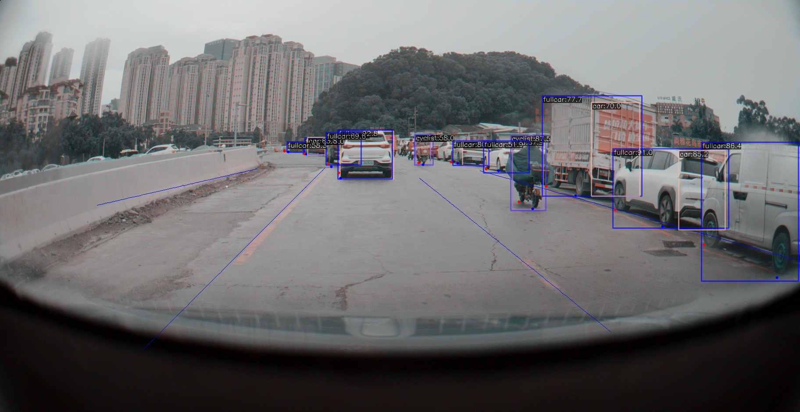

### 批量推理

MMDetection 在测试模式下，既支持单张图片的推理，也支持对图像进行批量推理。默认情况下，我们使用单张图片的测试，你可以通过修改测试数据配置文件中的 `samples_per_gpu` 来开启批量测试。
开启批量推理的配置文件修改方法为：

```shell
data = dict(train_dataloader=dict(...), val_dataloader=dict(...), test_dataloader=dict(batch_size=2, ...))
```

或者你可以通过将 `--cfg-options` 设置为 `--cfg-options test_dataloader.batch_size=` 来开启它。

### 视频样例

这是在视频样例上进行推理的脚本。

```shell
python demo/video_demo.py \
    ${VIDEO_FILE} \
    ${CONFIG_FILE} \
    ${CHECKPOINT_FILE} \
    [--device ${GPU_ID}] \
    [--score-thr ${SCORE_THR}] \
    [--out ${OUT_FILE}] \
    [--show] \
    [--wait-time ${WAIT_TIME}]
```

运行样例：

```shell
python demo/video_demo.py demo/demo.mp4 \
    configs/rtmdet/rtmdet_l_8xb32-300e_coco.py \
    checkpoints/rtmdet_l_8xb32-300e_coco_20220719_112030-5a0be7c4.pth \
    --out result.mp4
```

结果样例：


### 视频样例，显卡加速版本

这是在视频样例上进行推理的脚本，使用显卡加速。

```shell
python demo/video_gpuaccel_demo.py \
     ${VIDEO_FILE} \
     ${CONFIG_FILE} \
     ${CHECKPOINT_FILE} \
     [--device ${GPU_ID}] \
     [--score-thr ${SCORE_THR}] \
     [--nvdecode] \
     [--out ${OUT_FILE}] \
     [--show] \
     [--wait-time ${WAIT_TIME}]

```

运行样例：

```shell
python demo/video_gpuaccel_demo.py demo/demo.mp4 \
    configs/rtmdet/rtmdet_l_8xb32-300e_coco.py \
    checkpoints/rtmdet_l_8xb32-300e_coco_20220719_112030-5a0be7c4.pth \
    --nvdecode --out result.mp4
```

例如，运行：

```
python demo/video_demo.py demo/xingche2.mp4 \
    configs/yolox/yolox_s_8xb8-300e_coco.py \
    work_dirs/yolox_s_8xb8-300e_coco/epoch_220.pth \
    --out xingche2.mp4
```


## 实验数据集

任务：基于Yolo完成目标检测任务，学习标签的的车头尾框+整体框+轮胎点，实现模型在平台部署并推理、筛选数据。

训练模型对所采集的数据进行数据清洗，模型要求能够筛选出所给数据中的出现待检测目标的图片，包括整车（car）、车头车尾（car）、行人（ped）和骑行者（cyclist）。模型训练使用的数据集是经过筛选的camera数据，共112964张，标注了4个类别，包括整车（car）、车头车尾（car）、行人（ped）和骑行者（cyclist）：

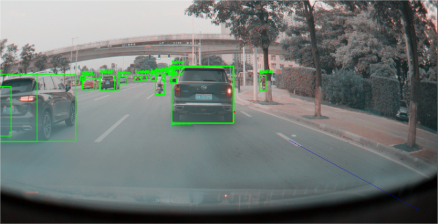

<!--  -->

该数据集筛选含有待检测的4类目标，并且至少有距离摄像头50米以内的目标的数据。数据集按照9：0.5：0.5的比例划分训练集、验证集和测试集。数据集转换成mmdetection要求的coco格式，存放在 `/feixiaoyue/camera_selected_50`

训练完成的模型参数权重文件存放在 `/feixiaoyue/mmdetection/work_dirs`


## MMdetection框架YOLOX的KPI计算方法解释

在目标检测中，评估模型性能的指标通常包括精度、召回率以及平均精度等。以下是YOLOX在输出的测试结果中所展示的指标及其计算方法的解释：

### 混淆矩阵

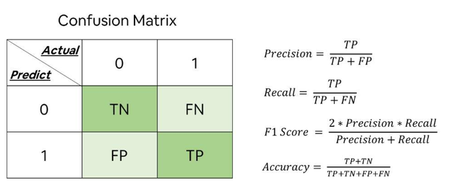

在目标检测中，通常使用混淆矩阵来计算不同类别的预测结果。然而，由于目标检测中存在大量的检测框（bounding box），常规的二分类混淆矩阵并不适用。因此，在目标检测中，更常用的指标是Recall（查全率）和Precision（精确率）。

### True Positive (TP)、False Positive (FP)、False Negative (FN)

- TP (True Positive): 正确预测为正类的检测框数量。
- FP (False Positive): 错误预测为正类的检测框数量。
- FN (False Negative): 没有被检测到的正类检测框数量。

### 查全率 (Recall) 和精确率 (Precision)

#### 查全率 (Recall)

查全率是指在所有正样本中，模型正确检测到的比例。公式如下：

$$
Recall=\frac{TP}{TP+FN}
$$

查全率反映了模型对正类样本的识别能力，即有多少正类样本被正确地找出。

#### 精确率 (Precision)

精确率是指在所有模型预测为正样本中，实际为正样本的比例。公式如下：

$$
precision=\frac{TP}{TP+FP}
$$

精确率反映了模型在所有预测为正类样本中的准确性，即有多少预测为正类的样本确实是正类。

### 平均精度 (Average Precision, AP)

平均精度是目标检测中常用的评估指标之一，它结合了不同IoU（Intersection over Union）阈值下的精度值，以综合评估模型性能。在YOLOX的输出结果中，给出了不同IoU阈值下的平均精度。

测试指标具体释义

- bbox_mAP: （默认）IOU=0.5 到 IOU=0.95， 每隔0.05个IOU计算一次AP，然后求平均值
- bbox_mAP_50: IOU=0.5时的AP值
- bbox_mAP_75: IOU=0.75时的AP值
- bbox_mAP_s/m/l: 即小中大三种不同尺度物体的AP值，其中small是指物体面积小于32 x 32， medium是指面积在32 x 32至96 x 96 之间，large是指面积大于96 x 96

例如， `Average Precision @[IoU=0.50:0.95 | area=all | maxDets=100]` 表示在IoU从0.50到0.95范围内，计算所有区域内最多100个检测框的平均精度。

### 其他区域的召回率

YOLOX还展示了不同目标区域（small、medium、large）下的平均召回率。这些指标可以帮助我们更好地理解模型在不同尺寸目标上的表现。

<!-- <video controls width="400">
    <source src="./resources/demo.mp4" type="video/mp4">
    Your browser does not support the video tag.
</video>

<video id="video" controls="" preload="none">
    <source id="mp4" src="./resources/demo.mp4" type="video/mp4">
</video>

<iframe height=1000 width=1000 src="./resouces/demo.mp4"></iframe> -->


## 模型训练结果

使用yolox模型进行训练，修改了模型的检测头文件 `mmdetection\mmdet\models\dense_heads\yolox_head.py` 。增加了：

- 关键点标签读取
- 关键点损失计算（偏移量的绝对值）
- 特征图初始化的关键点预测器
- 预测部分关键点初始化
- 前向传播时关键点预测
- 从头部提取的特征结果输出（预测）关键点
- 关键点预测结果的解码，转为原图片数据中的真实坐标

模型的configs文件存放位置为 `/home/omnisky/disk14/team/feixiaoyue/configs/yolox/yolox_s_8xb8-300e_coco.py` 

实现如下关键点标签预测效果：

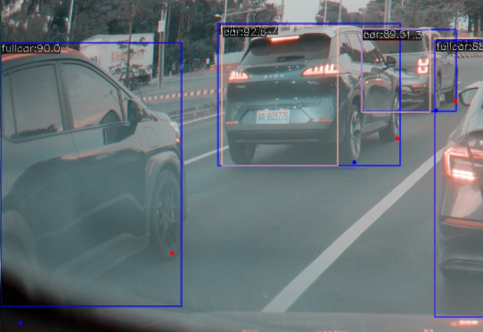

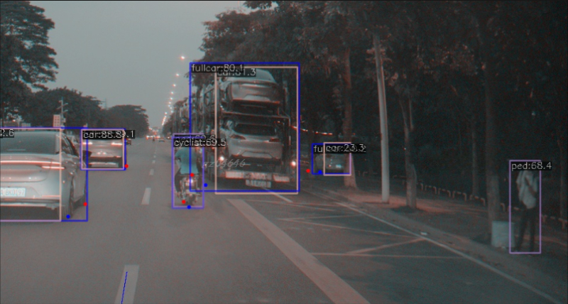

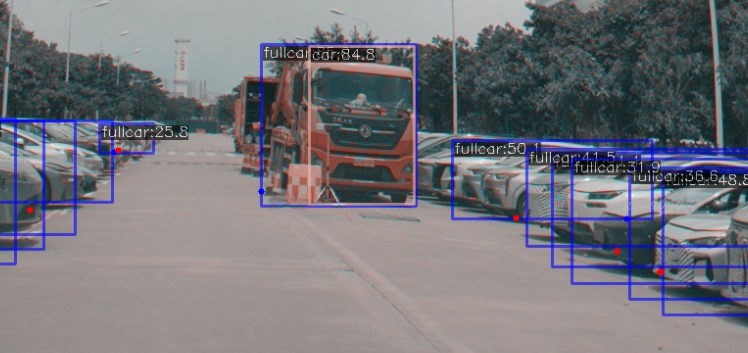

yolox_s的参数量和计算复杂度如下

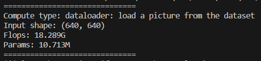

在数据集转换得到筛选之后的子数据集 `/home/omnisky/disk14/team/feixiaoyue/camera_selected_50` ，转换成 Object Keypoint类型的标注格式的COCO数据集格式 进行验证，得到实验结果yolox_s的测试结果：

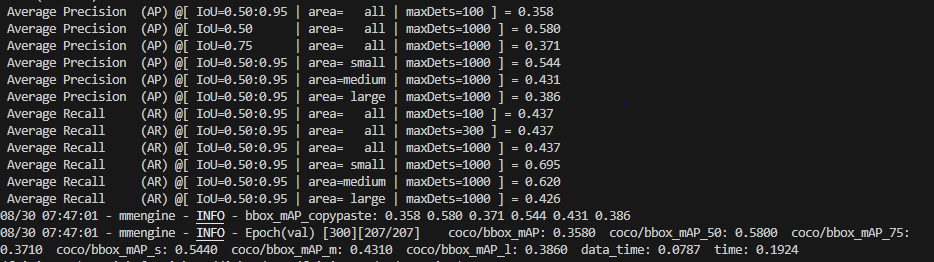

测试时通过参数得到推理结果.pkl文件，例如运行：

```shell
CUDA_VISIBLE_DEVICES=1 \
    python tools/test.py configs/yolox/yolox_s_8xb8-300e_coco.py \
    work_dirs/yolox_s_8xb8-300e_coco/epoch_300.pth \
    --out results.pkl
```

得到预测标签文件.pkl之后，您可以使用 `mmdetection/pkl_cv.py` 查看转换后的数据集文件 `mmdetection/data/val2017` 中目标对象的模型推理标签可视化效果：

```shell
python mmdetection/pkl_cv.py
```

数据进行可视化结果如下（含关键点标签）：

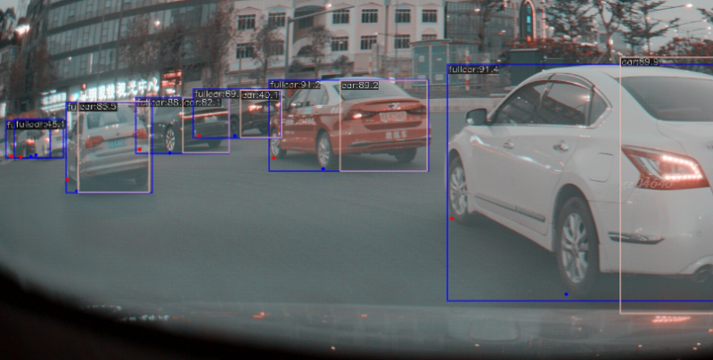

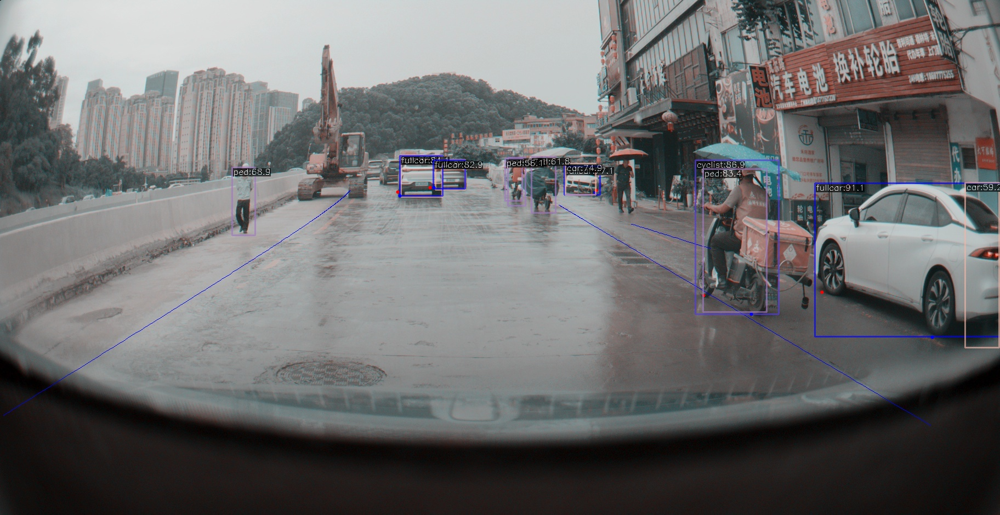

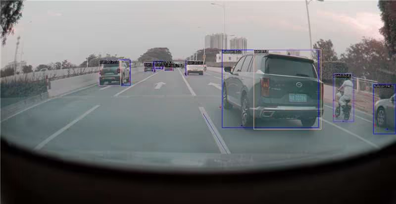

您可以使用 `mmdetection/combined_cv.py` 查看转换后的数据集文件 `mmdetection/data/val2017` 中目标对象的模型推理标签可视化以及原标签可视化拼接之后的对比结果：

```shell
python mmdetection/combined_cv.py
```

数据进行可视化对比结果如下：

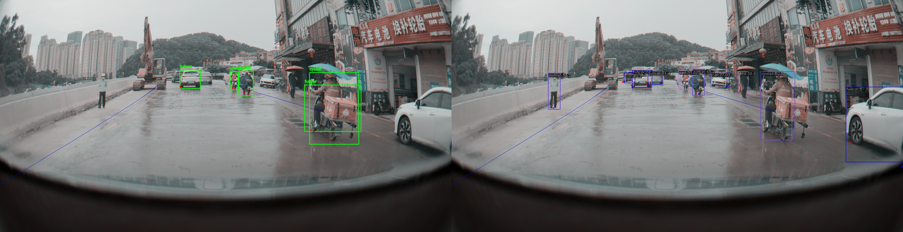

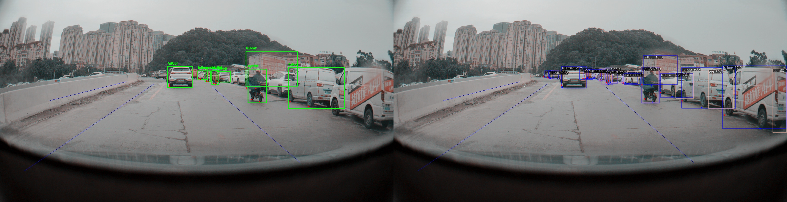

视频数据可视化结果：


## 模型部署

利用MMDeploy进行模型转换，以最新的预编译包为例，参考以下命令安装MMDeploy：

<details open>
<summary><b>Linux-x86_64</b></summary>

```shell
# 1. 安装 MMDeploy 模型转换工具（含trt/ort自定义算子）
pip install mmdeploy==1.2.0

# 2. 安装 MMDeploy SDK推理工具
# 根据是否需要GPU推理可任选其一进行下载安装
# 2.1 支持 onnxruntime 推理
pip install mmdeploy-runtime==1.2.0
# 2.2 支持 onnxruntime-gpu tensorrt 推理
pip install mmdeploy-runtime-gpu==1.2.0

# 3. 安装推理引擎
# 3.1 安装推理引擎 TensorRT
# !!! 若要进行 TensorRT 模型的转换以及推理，从 NVIDIA 官网下载 TensorRT-8.2.3.0 CUDA 11.x 安装包并解压到当前目录。
pip install TensorRT-8.2.3.0/python/tensorrt-8.2.3.0-cp38-none-linux_x86_64.whl
pip install pycuda
export TENSORRT_DIR=$(pwd)/TensorRT-8.2.3.0
export LD_LIBRARY_PATH=${TENSORRT_DIR}/lib:$LD_LIBRARY_PATH
# !!! 另外还需要从 NVIDIA 官网下载 cuDNN 8.2.1 CUDA 11.x 安装包并解压到当前目录
export CUDNN_DIR=$(pwd)/cuda
export LD_LIBRARY_PATH=$CUDNN_DIR/lib64:$LD_LIBRARY_PATH

# 3.2 安装推理引擎 ONNX Runtime
# 根据是否需要GPU推理可任选其一进行下载安装
# 3.2.1 onnxruntime
wget https://github.com/microsoft/onnxruntime/releases/download/v1.8.1/onnxruntime-linux-x64-1.8.1.tgz
tar -zxvf onnxruntime-linux-x64-1.8.1.tgz
export ONNXRUNTIME_DIR=$(pwd)/onnxruntime-linux-x64-1.8.1
export LD_LIBRARY_PATH=$ONNXRUNTIME_DIR/lib:$LD_LIBRARY_PATH
# 3.2.2 onnxruntime-gpu
pip install onnxruntime-gpu==1.8.1
wget https://github.com/microsoft/onnxruntime/releases/download/v1.8.1/onnxruntime-linux-x64-gpu-1.8.1.tgz
tar -zxvf onnxruntime-linux-x64-gpu-1.8.1.tgz
export ONNXRUNTIME_DIR=$(pwd)/onnxruntime-linux-x64-gpu-1.8.1
export LD_LIBRARY_PATH=$ONNXRUNTIME_DIR/lib:$LD_LIBRARY_PATH
```


### 模型转换

在准备工作就绪后，我们可以使用 MMDeploy 中的工具 `tools/deploy.py`，将 OpenMMLab 的 PyTorch 模型转换成推理后端支持的格式。
对于`tools/deploy.py` 的使用细节，请参考 [如何转换模型](02-how-to-run/convert_model.md)。

使用如下命令，将 PyTorch 模型转换为 TenorRT 模型，从而部署到 NVIDIA GPU 上.

```shell

# 执行转换命令，实现端到端的转换
python mmdeploy/tools/deploy.py \
    mmdeploy/configs/mmdet/detection/detection_tensorrt_dynamic-320x320-1344x1344.py \
    mmdetection/configs/yolox/yolox_s_8xb8-300e_coco.py \
    work_dirs/yolox_s_8xb8-300e_coco/epoch_300.pth \
    mmdetection/demo/demo.jpg \
    --work-dir mmdeploy_model/faster-rcnn \
    --device cuda \
    --dump-info
```

转换结果被保存在 `--work-dir` 指向的文件夹中。**该文件夹中不仅包含推理后端模型，还包括推理元信息。这些内容的整体被定义为 SDK Model。推理 SDK 将用它进行模型推理。**

```{tip}
把上述转换命令中的detection_tensorrt_dynamic-320x320-1344x1344.py 换成 detection_onnxruntime_dynamic.py，并修改 --device 为 cpu，
即可以转出 onnx 模型，并用 ONNXRuntime 进行推理。
```

## 引文

```latex
@article{yolox2021,
  title={{YOLOX}: Exceeding YOLO Series in 2021},
  author={Ge, Zheng and Liu, Songtao and Wang, Feng and Li, Zeming and Sun, Jian},
  journal={arXiv preprint arXiv:2107.08430},
  year={2021}
}
```